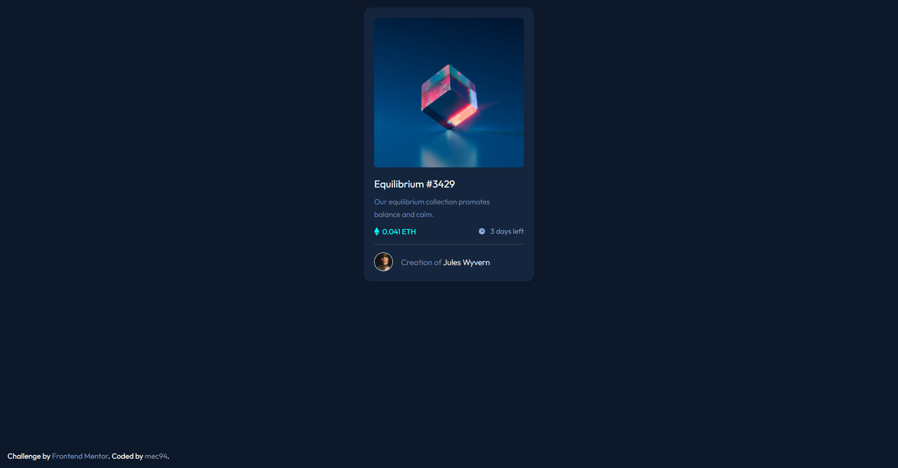

# Frontend Mentor - NFT preview card component solution

This is a solution to the [NFT preview card component challenge on Frontend Mentor](https://www.frontendmentor.io/challenges/nft-preview-card-component-SbdUL_w0U). Frontend Mentor challenges help you improve your coding skills by building realistic projects. 

## Table of contents

- [Overview](#overview)
  - [The challenge](#the-challenge)
  - [Screenshot](#screenshot)
  - [Links](#links)
- [My process](#my-process)
  - [Built with](#built-with)
  - [What I learned](#what-i-learned)
  - [Continued development](#continued-development)
  - [Useful resources](#useful-resources)
- [Author](#author)
- [Acknowledgments](#acknowledgments)

**Note: Delete this note and update the table of contents based on what sections you keep.**

## Overview

### The challenge

Users should be able to:

- View the optimal layout depending on their device's screen size
- See hover states for interactive elements

### Screenshot



### Links

- Solution URL: [Add solution URL here](https://your-solution-url.com)
- Live Site URL: [Add live site URL here](https://your-live-site-url.com)

## My process

### Built with

- Vanilla CSS
- CSS Variables
- Flexbox
- Mobile-first workflow
- CSS Transition Property
- CSS Hover with Pseudo Elements

### What I learned

```css
.nft-visual::after {
    content: url('../images/icon-view.svg');
    position: absolute;
    top: 50%;
    left: 50%;
    transform: translate(-50%, -50%);
    opacity: 0;
    transition: opacity .5s;
}

.nft-visual:hover::after {
    opacity: 1;
}
```

### Continued Development

Since im more used to work with Flexbox now, i want to deepen my knowledge on GRID and learn more about the best use cases for both of these powerful tools.

### Useful resources

- [Pretagteam](https://pretagteam.com/question/make-image-appear-on-link-hover-css) - Great place to find answers to common questions devs make

## Author

- Website - [Full Games](https://full.games)
- Frontend Mentor - [@mec94](https://www.frontendmentor.io/profile/mec94)
# nft-preview-card-component-fm
